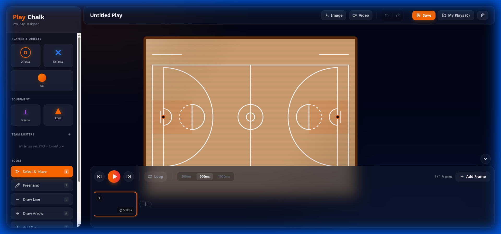
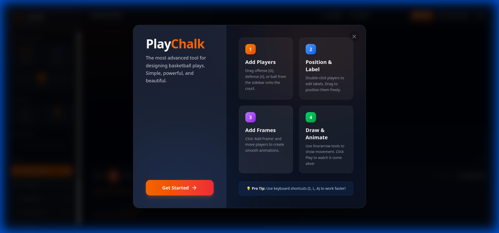

# PlayChalk 🏀

PlayChalk is a premium, interactive basketball play design tool built for coaches and strategists. It features a realistic court interface, drag-and-drop player positioning, and timeline-based play animation.



## Features

- **Realistic Court Rendering**: High-quality court textures with professional markings.
- **Interactive Play Design**: Drag and drop players (Offense, Defense) and the ball.
- **Animation Timeline**: Create complex plays with a timeline-based animation system.
- **Export Capabilities**: Export your plays as images or videos to share with your team.
- **Modern UI**: Built with a sleek, glassmorphism-inspired interface for a premium experience.



## Tech Stack

- **Framework**: React 19 + Vite
- **Language**: TypeScript
- **Styling**: TailwindCSS 4
- **Canvas**: Konva + React-Konva
- **Animations**: Framer Motion
- **State Management**: Zustand

## Getting Started

1.  **Clone the repository**

    ```bash
    git clone https://github.com/yourusername/playchalk.git
    cd playchalk
    ```

2.  **Install dependencies**

    ```bash
    npm install
    ```

3.  **Run the development server**

    ```bash
    npm run dev
    ```

4.  Open [http://localhost:5173](http://localhost:5173) to view it in the browser.

## License

MIT
